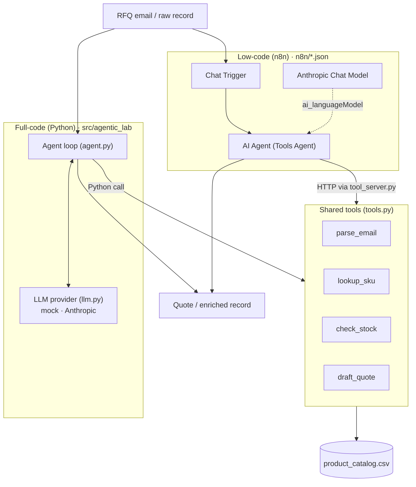
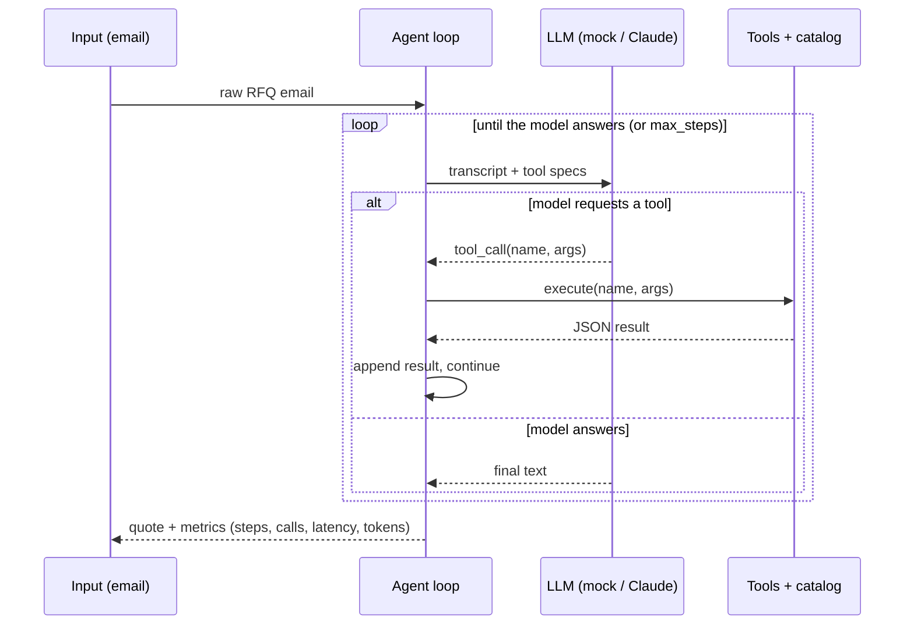

# Architecture

One agentic use case, built three ways, sharing one tool layer — so the
comparison is controlled.

## The three builds



The **full-code** agent calls the tools directly as Python functions. The
**low-code** n8n agent calls the *same* functions over HTTP (`tool_server.py`).
Because both hit one implementation and one catalog, any behaviour difference is
orchestration, not logic — which is exactly what the benchmark isolates.

## The agent loop (the "agentic" part)



The number of loop iterations is **data-dependent** (one lookup + one stock check
per line item). That is the line between an *agent* (model drives control flow)
and a *workflow* (control flow fixed in advance) — see
[DECISION_GUIDE.md](DECISION_GUIDE.md).

## Provider abstraction

`agent.py` never imports a model SDK. It talks to an `LLMProvider` with one
method, `complete(system, messages, tools) -> LLMResponse`. Two implementations:

- **`MockProvider`** — deterministic; a `policy(messages, tools)` function reads
  the transcript and returns the next tool call or the final answer. Zero deps,
  zero key, fully reproducible → CI-safe.
- **`AnthropicProvider`** — real Claude tool-use, imported lazily.

Swap them with one env var (`LLM_PROVIDER`). This is what keeps the benchmark
fair (both builds face the same contract) and the repo runnable by anyone.

## Repo layout

```
src/agentic_lab/       full-code agent: llm, agent, tools, catalog, tool_server, usecases/, CLI
n8n/                   importable workflow JSON (low-code build) + how-to
data/                  product_catalog.csv + sample RFQ emails
benchmarks/            run_benchmark.py + committed results/ (metrics, scorecard, charts)
tests/                 pytest: tools, agents (mock), n8n JSON structure
docs/                  this file + evaluation framework, decision guide, PA comparison, use cases
.github/workflows/     CI: ruff + pytest + CLI smoke + benchmark + JSON validation
docker-compose.yml     self-hosted n8n + Postgres
```
